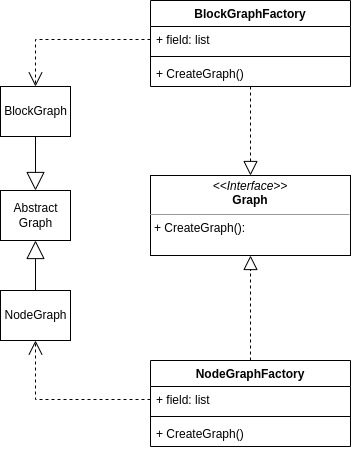

# ALGORITHMS VISUALIZER
### Video Demo:  <URL HERE>
### Description:
- A web application that visualizes algorithms from code (initially provides sorting algorithms demonstration).
- Tools: 
HTML/CSS/JavaScript 
| [Bootstrap](https://getbootstrap.com/)
| [Python/Flask](https://flask.palletsprojects.com/en/2.2.x/)
- (Updated) This project has been hosted in 
[Heroku](https://www.heroku.com), 
detailed deployment configurations are shown in the <code>main</code> branch
- Demo: [Algorithms Visualizer app](https://tuss-algorithm-visualizer.herokuapp.com/)

#### Detail
##### File system

<code>app.py</code> 
The <code>app.py</code> file is where the project starts running. 
The app features only focuses on the visualizations, so it does not have much things to do with the backend so far.
Thus, you can see inside the <code>app.py</code> there are only a bunch of routes which redirect to 
<code>html</code> files. 

<code>requirements.txt</code> 
The <code>requirements.txt</code> simply precribes the dependencies of the project.
Inside the file, you can see it includes only a <code>flask</code> keyword, because the app is built on 
[Flask](https://flask.palletsprojects.com/en/2.2.x/) framework. 
If we deploy the project, other dependencies (ex. <code>gunicorn</code>, ...) may need to be included as well. 

<code>static/</code> 
Inside the <code>static</code> directory, we can see this app's core structure.
The folder contains two children directories, which are 
<code>css</code> and <code>js</code>.
- <code>css/</code> 
The folder includes a CSS file, to make some custom decorations other than Bootstrap.
- <code>js/</code> 
Take a look at <code>js</code> folder, we realize that all JavaScript files are stored in there.
It also defines the core mechanics of the visualizations.
    + <code>lib/</code> 
    The <code>lib</code> folder stores custom shared components that will be used in multiple facets of the app.
    It currently has three modules 
    <code>GraphFactory</code>, <code>nodectrl</code> and <code>VisualizationSupport</code>: 
    <code>GraphFactory/</code> is a factory module which is defined by applying factory design pattern, and it is 
    used for producing an initial graph that is waiting for the demonstration. You may want to learn more about this 
    graph factory's structure in [below](#more-about-graph-factory). 
    <code>nodectrl.js</code> implements all classes that are used to modify components in DOM. 
    <code>VisualiztionSupport.js</code> implements all methods that supports the visualization. 
    + <code>sort/</code> 
    The <code>sort</code> folder contains all sorting visualizer modules corresponding to <code>sort</code> html files in 
    <code>templates/</code>. 

<code>templates/</code> 
The <code>templates</code> follows the [jinja](https://jinja.palletsprojects.com/en/3.1.x/) templete engine and contains
HTML files, stylized by [Bootstrap](https://getbootstrap.com/), which construct an user interface for the app.
Inside the directory, the <code>core</code> stores all needed html files to display the app on browsers,
and the <code>layouts</code> includes a main layout used by all other pages in the <code>core</code>.
- <code>core/</code> 
The <code>index.html</code> is the initial page being shown up when users open the app. 
In the <code>sort</code> folder, there are templates for all sorting displays, which show the UI that have users interact
with the demonstration.
- <code>layouts/</code> 
The <code>layout.html</code> consists of some big components that are used by others pages: A navigation bar, a canvas
and a control box. 
There are three [jinja](https://jinja.palletsprojects.com/en/3.1.x/) template blocks you can notice in the file. 
    + <code></code> is where the title of each page is named.
    + <code></code> is where the visualization is displayed.
    + <code></code> is where the JavaScript module is imported into the HTML DOM.

##### More about Graph Factory
<!-- <code>Graph Factory</code>  -->
I started this project while I was learning [OOP & Design Pattern](https://refactoring.guru/design-patterns).
It turned out I can apply a creational pattern in building the graph for my visualizer. Thus, I immediately 
came up with a diagram as shown belown, based on [Abstract Factory](https://refactoring.guru/design-patterns/abstract-factory)
design pattern.

Two factories are created by implementing an interface <code>Graph</code>, which are <code>BlockGraphFactory</code> and
<code>NodeGraphFactory</code>. The <Code>CreateGraph()</code> method in each factory produces a corresponding object
(<code>BlockGraph</code> and <code>NodeGraph</code>) that inherites from the <code>Graph</code> object, and the 
<code>draw()</code> method in those objects creates HTML elements then appends to DOM.

> A limitation is that JavaScript does not support fully OOP, so the code is a little different from normal. To be able to write it
> completely like OOP then I may want to switch to TypeScript later 🤔 
> You saw that I mentioned <code>NodeGraph</code>, but there is nothing inside the class <code>NodeGraphFactory</code> so far. This
> is because I plan to write it for <code>Searching</code> algorithms, and it belongs to further development. In this project, I only
> scale down to <code>sorting</code> algorithms as I said in [Description](#description).

### Running (local machine)
In the root directory of this project, start Flask's built-in server: 
<pre> $ flask run </pre>

### Further development and future ideas
- 
